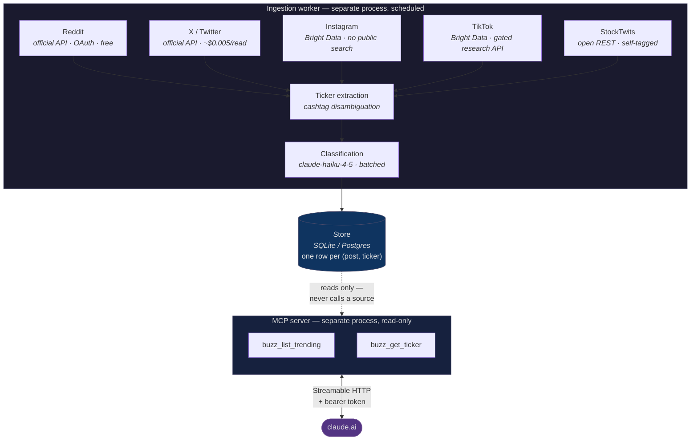

# Cashtag

**An MCP connector that surfaces stocks with unusually high social-media mention volume, with a bullish/bearish sentiment split per ticker.**

Ask Claude *"what stocks are buzzing right now?"* and get a real answer, grounded in Reddit, X, Instagram, TikTok, and StockTwits.

```
> what stocks are buzzing right now?

SOFI   42 mentions (14.0x normal)  81% bullish   ← top source: reddit
GME    95 mentions (11.9x normal)  79% bullish   ← top source: reddit
PLTR   31 mentions ( 6.2x normal)  54% bullish   ← top source: reddit
AMC    22 mentions ( 5.5x normal)  35% bullish   ← top source: reddit
NVDA   68 mentions ( 2.3x normal)  78% bullish   ← top source: x
```

<!--
RECORD THE DEMO — the one deliverable that must come from your own claude.ai
account, then UNCOMMENT the line below. (It is commented out so the README does
not show a broken-image icon before the GIF exists.)


  1. Deploy (see Deployment below) and add the connector in claude.ai.
  2. Start a fresh chat. Record with QuickTime (Cmd+Shift+5) or Kap (https://getkap.co).
  3. Ask, in this order — it tells a story in ~25 seconds:
       "what stocks are buzzing right now?"
       "why is GME on that list?"          ← shows `criteria` being explained back
       "what about TSLA?"                  ← shows a NOT-buzzing ticker, the interesting case
  4. Trim to under 30s, export as GIF, save as docs/demo.gif.

  Keep the SYNTHETIC DATA warning visible if you record before Reddit approval —
  it demonstrates the guardrail rather than hiding it, and a hiring manager who
  spots seeded data being passed off as real will stop reading.
-->

---

## Why this is interesting

The naive version of this project is a sentiment dashboard. The interesting parts are the four places where the naive version is wrong:

1. **"Buzzing" needs two thresholds, not one.** Ratio alone ranks noise; volume alone ranks mega-caps. → [Methodology](#the-buzz-methodology)
2. **With no history, the honest answer is "I don't know."** The first live run reported AAPL "buzzing at 96× normal" on an ordinary Tuesday. Nothing threw — it was just confidently wrong. → [Cold start](#cold-start-why-an-empty-answer-beats-a-confident-wrong-one)
3. **The four data sources cannot share an access method.** One has a free API, one bills per read, two have no public search at all. → [Four sources, four access models](#four-sources-four-access-models)
4. **Ticker extraction is the hard problem, not sentiment.** `$IT` is Gartner; `IT` is a department. → [Ticker extraction](#ticker-extraction-the-hard-part)

---

## Architecture

The core claim: **the MCP tools never touch a source API.** Ingestion is slow, flaky, rate-limited and billable; a tool call must be none of those things. So they are separate processes with a database between them, and a tool call is a handful of indexed local queries.



**Why the split matters.** If the tools called sources synchronously, every Claude query would inherit Reddit's latency, X's rate limits, Bright Data's minutes-long scrape jobs, and a per-read bill scaled by *how often someone asks a question*. Instead: ingestion runs on a schedule (every 15 min during market hours, hourly otherwise), classification runs as its own pass, and the tools read pre-computed rows. Cost scales with *time*, not with *usage*.

The classification step is separate from ingestion for the same reason at a smaller scale: ingestion is bound by five different upstreams, classification is metered spend against one API. Split, each retries on its own terms. The `sentiment IS NULL` column is the queue between them.

---

## The buzz methodology

A ticker is flagged **only when both conditions hold**:

| Condition | Threshold | Constant |
|---|---|---|
| Trailing-24h mentions | ≥ 15 | `BUZZ_MIN_MENTIONS_24H` |
| 24h mentions ÷ 14-day trailing daily average | ≥ 2.0 | `BUZZ_SCORE_THRESHOLD` |

Both are configurable in [`src/cashtag/config.py`](src/cashtag/config.py).

### Why both

Each threshold alone produces a specific, predictable failure. The demo dataset contains both, deliberately:

| Ticker | 24h | Baseline | Score | Ratio-only says | Volume-only says | **Cashtag says** |
|---|---|---|---|---|---|---|
| **RIVN** | 12 | 1.0/day | 12.0x | 🚩 flag it | ✅ ignore | ✅ **ignore** — 1→12 mentions is noise with a good ratio |
| **TSLA** | 45 | 40.0/day | 1.1x | ✅ ignore | 🚩 flag it | ✅ **ignore** — always loud, nothing happened |
| **GME** | 95 | 8.0/day | 11.9x | 🚩 flag it | 🚩 flag it | 🚩 **flag it** — genuinely unusual |

Requiring both means *"unusually loud, **and** loud enough to matter."*

### The baseline window excludes the trailing 24h

This is the most consequential line in the methodology:

```
├─────────── 14-day baseline ───────────┤├──── trailing 24h ────┤
                                         ↑
                              windows abut, never overlap
```

If the trailing 24h were included in its own baseline, a spike would inflate its own denominator and **suppress its own score** — the detector would be least sensitive exactly when something is happening. The windows abut with no gap (a gap would silently discard mentions).

### The zero-baseline problem

A ticker with no history has a baseline of 0.0. Dividing by it is either a crash or an `inf` that pins the ticker to the top of the list forever. The denominator is floored at `BASELINE_FLOOR = 0.5`, which caps a cold-start ticker's score at 2× its raw count — it can still rank, but it can't dominate on the strength of having no past.

### Cold start: why an empty answer beats a confident wrong one

The floor above fixes the crash and introduces a subtler bug, which the first live ingest found immediately.

StockTwits needs no credentials, so the very first run pulled 825 real mentions. Every ticker then had *zero baseline history* — all the data was inside the trailing-24h window. Each baseline floored to 0.5, making `buzz_score = 2 × raw count`, and the tool cheerfully reported:

```
18 tickers BUZZING
AAPL   48 mentions   baseline 0.0/day   score 96.0x   ← on an ordinary Tuesday
```

Nothing threw. Nothing looked broken. AAPL is simply *always* the most-discussed stock, and 96× "normal" was pure division artifact. **This is the worst failure mode a data product has: confidently wrong, and indistinguishable from working.**

The fix is conceptual, not arithmetic. *Buzz is a comparison against normal — with no history, there is no normal, and the honest output is "I can't know yet."*

- **< 3 days of baseline history** (`MIN_BASELINE_COVERAGE_DAYS`): `buzz_list_trending` returns **nothing** and explains why. `buzz_get_ticker` still returns mention counts, sources, trend, and sentiment — all accurate from the first tick — with `buzz_score = 0` and `is_buzzing = false`. Only the *comparison* needs history.
- **3–14 days**: scores are computed against **actual observed days**, not an assumed 14, and marked `PROVISIONAL`. (Dividing 3 days of observations by 14 understates the baseline ~4.7× and inflates every score by the same factor.)
- **14+ days**: full methodology.

Same live data, after the fix:

```
tickers flagged: 0
NOTE: Not enough history to detect buzz yet... only 0.1 days of baseline history
      have been observed (need 3, ideally 14)... mention counts via
      buzz_get_ticker are already accurate and usable.
```

Regression tests are in [`test_warmup.py`](tests/test_warmup.py), including the literal AAPL-at-96× case.

### Sentiment: two denominators, on purpose

```
bullish_pct = bullish / (bullish + bearish) × 100      ← opinionated posts only
bearish_pct = 100 - bullish_pct
neutral_pct = neutral / (bullish + bearish + neutral) × 100   ← ALL classified posts
```

**These three do not sum to 100. That is intended, not a bug.**

`bullish_pct` answers *"which way are the people with an opinion leaning?"* — 100 = fully bullish, 0 = fully bearish. `neutral_pct` answers a different question: *"how many of them even have an opinion?"* It's a data-quality signal, not a third slice of the pie.

Folding neutral into the directional denominator would break the metric: a ticker with 10 bullish, 0 bearish, and 90 neutral posts would report **10% bullish** — which reads as bearish, when opinion was in fact unanimously bullish. There's a test pinning exactly this ([`test_sentiment.py`](tests/test_sentiment.py)), so a future "fix" fails loudly instead of silently changing what every number in the product means.

When there are no opinionated posts, `bullish_pct` is **null**, not 50 — a 50 would be indistinguishable from a genuinely tied market. Raw counts are always returned so you can compute any denominator you prefer.

---

## Four sources, four access models

Each platform gets the access method its API landscape actually permits. This is the part that surprised me most while building it, and it's the honest answer to "why is this file so different from that one?"

| Source | Access model | Auth | Cost | Confidence | Why this way |
|---|---|---|---|---|---|
| **Reddit** | Official API (PRAW) | OAuth2 | Free (non-commercial tier) | **High** | The only source with a real, free, sanctioned read API. Long-form text with explicit tickers. |
| **X** | Official API v2 | Bearer | **~$0.005/read** | High | No free tier as of Feb 2026. Every design choice in that file is about not overspending. |
| **Instagram** | Bright Data feeds | Vendor key | Vendor pricing | **Low** | Graph API only reaches accounts you own. No public hashtag search exists for third parties. |
| **TikTok** | Bright Data feeds | Vendor key | Vendor pricing | **Low** | Research API is gated to approved academic/nonprofit researchers. A portfolio project doesn't qualify. |
| **StockTwits** | Open REST | None | Free | Medium | Stretch goal — but see below, it earns its place. |

### What each constraint forced

**Reddit → free, so it's the validation source.** Build order was: prove the whole pipeline end-to-end on Reddit alone before adding anything else. Everything downstream (extraction, classification, buzz scoring, tools) is source-agnostic, so if it works on Reddit it works.

Two things bite people here: the User-Agent is enforced (a generic one gets you 429'd), and the free non-commercial tier needs a **separate approval form** beyond registering the app — review takes 2–4 weeks. That's the long pole; start it first.

**X → metered, so the budget cap is a real feature.** `X_MONTHLY_BUDGET_USD` is enforced **against a spend ledger in the database, checked before every call**, not an in-memory counter. That distinction is the whole point: containers restart, and an in-memory cap resets to zero on every deploy and crash-loop — that's an unbounded bill wearing a budget's clothing. It also fails *closed*: budget exhausted → X returns nothing, logs a warning, other sources keep working. Reads are cursored (`since_id`, persisted) because re-reading a tweet is money spent to learn nothing.

**Instagram + TikTok → no API, so they're vendor-scraped and weighted last.** They ship last and get least trust, for reasons in the code: async trigger→poll→fetch (always a cycle behind), caption-only (a TikTok whose thesis is spoken aloud is an empty caption with three emojis), and sampled rather than census — which breaks the assumption the buzz baseline rests on. **If Instagram or TikTok is a ticker's `top_source`, treat it as a coverage artifact, not a crowd.**

**StockTwits → free ground truth.** Posts are self-tagged bullish/bearish *by their authors*. The tag is stored in `author_sentiment` and deliberately **never** shown to the classifier, which makes it a held-out evaluation set:

```bash
python scripts/eval_classifier.py
# Directional agreement: 66/75 = 88.0%
# Confusion (author tag -> classifier label):
#   OK    bullish -> bullish      44
#   MISS  bearish -> bullish       5
```

Shortcutting — trusting the self-tag as the label — would save a few cents of Haiku calls and destroy the only ground truth in the system. Caveats are in the script and printed with the result: it measures agreement with *self-reported intent* on short blunt posts, doesn't measure neutral recall, and Reddit's longer hedged posts will score worse.

---

## Ticker extraction (the hard part)

The project is named after this. Naive `\$?[A-Z]{1,5}` matching produces garbage, and the garbage isn't evenly distributed — it concentrates in exactly the tickers whose symbols collide with English:

```python
"I work in IT and I like stocks"     → {}         # not $IT (Gartner)
"PUT ON YOUR SEATBELT"               → {}         # not $ON (ON Semiconductor)
"Here is my DD on this company"      → {}         # not $DD (DuPont)
"My PT is 400 by year end"           → {}         # not $PT
"$IT had good earnings"              → {"IT"}     # explicit $ = author's intent
"See https://reddit.com/r/GME"       → {}         # URLs stripped
"TSLA 250c 7/18 printing"            → {"TSLA"}   # option contracts KEPT
```

Three rules: explicit `$CASHTAG` bypasses the ambiguity filter (the `$` is the author telling you they mean a ticker); bare symbols must clear a stoplist of ~140 English words and forum slang; everything must be in a configured universe (unbounded ticker space means every typo becomes a stock).

**Precision is weighted far above recall.** Missing some GNRC mentions costs one ticker some volume. Letting `IT` through makes Gartner permanently the most-discussed stock on Reddit and corrupts every ranking in the product.

---

## Quick start

```bash
git clone <your-repo-url> && cd cashtag
uv venv && uv pip install -e ".[dev]"
cp .env.example .env

# Demoable immediately — no credentials needed.
python scripts/seed_demo.py --reset
python -m pytest                       # 105 tests
python -m uvicorn cashtag.server:build_app --factory --port 8000
curl localhost:8000/health
```

Seed data is written with `is_synthetic=True`, and **every tool response touching a synthetic row carries a loud `SYNTHETIC DATA` warning**. Fake market signal that reads as real is genuinely dangerous — someone could trade on it.

### Real data with zero credentials

StockTwits needs no auth, so the pipeline produces **real** data on first run — no keys, no approval wait:

```bash
python -m cashtag.worker        # ~800 real mentions on the first tick
```

The other four sources skip cleanly with a logged reason. Note that `buzz_list_trending` will report [warming up](#cold-start-why-an-empty-answer-beats-a-confident-wrong-one) until ~3 days of baseline accumulate — that's the guard working, not a failure. `buzz_get_ticker` returns accurate counts immediately.

### Going live

```bash
# 1. Reddit — do this FIRST, approval takes 2-4 weeks
#    Register a "script" app: https://www.reddit.com/prefs/apps
#    Then apply for the free non-commercial tier (separate form).
#    Set REDDIT_CLIENT_ID / REDDIT_CLIENT_SECRET / REDDIT_USER_AGENT in .env

# 2. Classification
#    Set ANTHROPIC_API_KEY in .env

# 3. Run the worker
python -m cashtag.worker
```

Sources with missing credentials are **skipped, not fatal** — the worker logs each source's status at startup and keeps going. A connector that loses four sources because one key is absent isn't a connector.

---

## Deployment

`render.yaml` is a complete blueprint: web service + background worker + Postgres.

**One real constraint, worth knowing before you hit it:** SQLite works locally but **not** for this deployment. The server and worker are separate services, and on Render (as on Fly and Railway) a persistent disk attaches to exactly one service — two services can't share a SQLite file, and without a disk the filesystem is ephemeral so every deploy silently resets the store. Hence Postgres in production. The only thing that changes is `CASHTAG_DATABASE_URL`; no code changes, which is the payoff for keeping `db.py` free of dialect-specific SQL.

```
Render Dashboard → New → Blueprint → select repo → fill secrets
```

Then in **claude.ai → Settings → Connectors → Add custom connector**:

| Field | Value |
|---|---|
| URL | `https://your-service.onrender.com/mcp` |
| Header | `Authorization: Bearer <CASHTAG_AUTH_TOKEN>` |

Auth notes: the token check is pure-ASGI middleware (not `BaseHTTPMiddleware`, which buffers and breaks streamable HTTP's long-lived responses), uses `secrets.compare_digest` (`==` short-circuits and leaks the token prefix to anyone who can time the response), and exempts only `/health`. Starting without a token logs a loud warning.

---

## MCP tools

### `buzz_list_trending(limit=20)`
Tickers currently flagged, sorted by `buzz_score` descending. Each: `ticker`, `mention_count_24h`, `buzz_score`, `bullish_pct` / `bearish_pct` / `neutral_pct`, `top_source`, 2–3 `sample_post_urls`. The response also carries `criteria` (the exact thresholds applied, so Claude can explain *why* something is listed), `data_freshness`, and `notes`.

### `buzz_get_ticker(ticker)`
On-demand detail for **any** ticker, buzzing or not. Adds `is_buzzing`, per-source breakdown, and a zero-filled 7-day trend. Accepts `TSLA`, `$GME`, or `nvda`.

Both are `readOnlyHint: true` and `openWorldHint: false` — they read a local store and reach nothing external.

---

## Tests

```bash
python -m pytest -q     # 105 passed
```

| File | Covers |
|---|---|
| [`test_buzz.py`](tests/test_buzz.py) | Threshold boundaries, zero-baseline division, window non-overlap, the RIVN/TSLA failure cases |
| [`test_sentiment.py`](tests/test_sentiment.py) | Dual denominators, null-vs-50 for undefined splits, the deliberate ≠100 sum |
| [`test_tickers.py`](tests/test_tickers.py) | Ambiguity filter, URL/code stripping, cashtag override, option contracts |
| [`test_warmup.py`](tests/test_warmup.py) | Cold-start guard, coverage-aware baselines, the literal AAPL-at-96× regression |
| [`test_integration.py`](tests/test_integration.py) | End-to-end over a real DB: dedupe on re-poll, savepoint isolation, both tools, synthetic flagging |

The pure functions carry the whole methodology and take no database — that's why they're trivial to test, and it's deliberate.

---

## Known limitations

Stated plainly, because they're real and I'd rather discuss them than have them found.

- **One label per post, not per (post, ticker).** A post saying *"long $GME, short $AMC"* gets one label applied to both tickers, so one is wrong. Rare — most posts are single-ticker — but a real ceiling on pairs-trade and comparison posts. Fixing it means classifying per (post, ticker), ~1.2× cost.
- **Instagram/TikTok are caption-only.** No audio, no video, no OCR. A TikTok whose entire thesis is spoken aloud is invisible.
- **Bot and brigade detection: none.** A coordinated push looks exactly like organic enthusiasm. For a signal about retail crowds this is the most significant gap.
- **Engagement isn't weighted.** A 5,000-upvote DD post counts the same as a one-line comment. Engagement is stored, just not used in scoring yet.
- **No exchange-holiday calendar.** Market-hours cadence runs on holidays. Costs a rounding error; a holiday calendar is a dependency plus an annual maintenance obligation.
- **The universe is a fixed list.** A ticker not in `tickers.py` is invisible — including the next meme stock, on the day it matters most.
- **`buzz_score` is a ratio, not a z-score.** It doesn't account for a ticker's baseline *variance*. A ticker that swings 5→50 naturally looks the same as one that's been flat at 5 for a year.

---

## Project layout

```
src/cashtag/
├── config.py        # every tunable; buzz thresholds are constants, not env vars
├── models.py        # Pydantic tool I/O schemas
├── db.py            # SQLAlchemy; SQLite ↔ Postgres by URL only
├── tickers.py       # cashtag extraction + ambiguity filter
├── buzz.py          # scoring & aggregation (pure functions + DB queries)
├── classify.py      # batched claude-haiku-4-5 classification
├── server.py        # FastMCP server, tools, bearer auth
├── worker.py        # scheduled ingestion + classification
└── sources/         # one file per access model
scripts/
├── seed_demo.py     # synthetic data so it's demoable today
└── eval_classifier.py
```

---

## Design decisions worth asking about

- Why `buzz_list_trending` **returns nothing** for the first three days rather than a plausible list: with no baseline there is no "normal", and the first live run proved what the alternative looks like (AAPL, 96×, ordinary Tuesday).
- Why buzz thresholds are **constants in code**, not env vars: they're the methodology, and a methodology that silently differs between environments isn't one.
- Why the **spend ledger lives in the database**: an in-memory cap resets on every container restart.
- Why **StockTwits self-tags are never shown to the classifier**: it's the only ground truth in the system.
- Why **`neutral_pct` uses a different denominator**: folding it in inverts the meaning of a mostly-neutral, unanimously-bullish ticker.
- Why the **baseline excludes the trailing 24h**: otherwise spikes suppress their own scores.
- Why **synthetic data is flagged at every layer** rather than just kept in a separate table: someone could trade on it.
